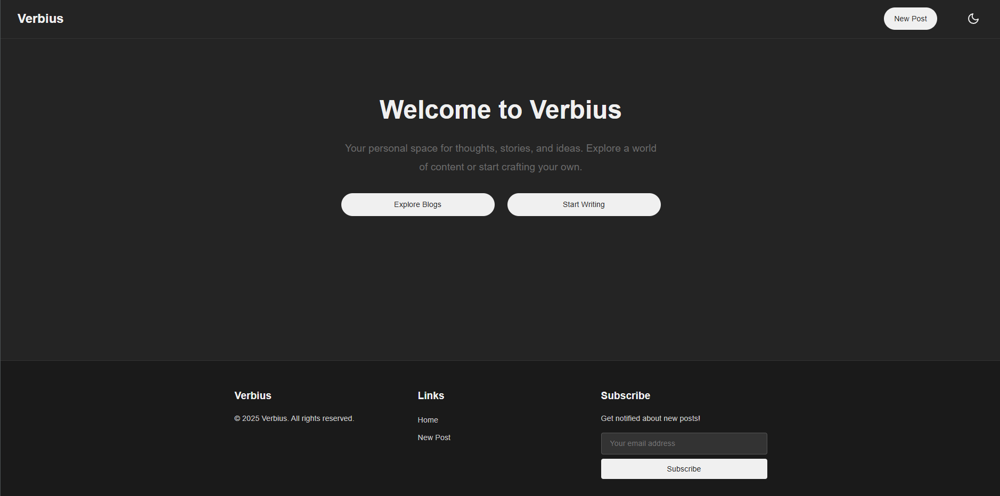
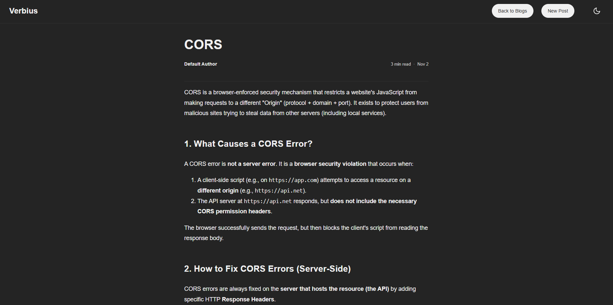

# Verbius (EnteBlog)

Lightweight blog/demo application containing a small backend and static frontend pages. This README describes the repository layout, how to run the app locally (Docker or node/python), and a dedicated screenshots section — drop screenshots into the `/screenshots` folder and they will be displayed here.

## Contents

- backend/: Node-based server and a set of subscriber/post sample content
- frontend/: Static frontend pages (welcome, viewer, editor, blogs) and public assets
- posts/: Sample post content used by the site
- settings/: Configuration (example fonts.yml)
- docker-compose.yml, Dockerfiles: containerized setup

## Quick start

Requirements (choose one): Docker & Docker Compose, or Node.js + npm (and optional Python for a static server).

Using Docker Compose (recommended for a consistent environment):

```powershell
# from repository root
docker-compose up --build
```

Run locally without Docker

1) Start the backend

```powershell
cd backend
npm install
node server.js
# server listens on configured port (see backend/server.js)
```

2) Serve the frontend

Option A — simple static server with Node:

```powershell
npx http-server ./frontend -p 8080
```

Option B — Python built-in server:

```powershell
cd frontend
python -m http.server 8080
```

Open a browser to the appropriate host/port, e.g. http://localhost:8080/welcome.html or the URL printed by the backend when running with Docker.

## Project structure (high level)

- backend/
	- server.js — main Node server
	- package.json — backend dependencies / scripts
	- subscribers.json — sample subscriber list
	- bin/ — sample content directories used as posts

- frontend/
	- welcome.html — landing page
	- blogs.html — list of posts
	- editor.html — editor UI for creating posts
	- viewer.html — single-post view
	- public/ — JS/CSS assets (api-config.js, script.js, style.css, flash-message.*)

## Screenshots

Drop screenshots into a top-level `/screenshots` directory (create it if needed). The README references file names below so they will render automatically in GitHub if the images exist.

Naming convention (suggested)

- `screenshots/Welcome.png` — Welcome / landing page
- `screenshots/Blogs.png` — Blogs / list page
- `screenshots/Editor.png` — Editor page
- `screenshots/Viewer.png` — Viewer / post page
- `screenshots/Flash-message.png` — Flash message component demo (optional)

Add other screenshots using the pattern: `screenshots/<page-or-feature>.png`.

Placeholders (these will show if you add the matching images):

### Welcome


### Blogs (list)


### Editor


### Viewer (post)


### Flash message / UI components


If you prefer other formats (jpg/webp), use that extension and update the filenames accordingly.

## How the app is organized

- Content is stored in simple directories under `backend/bin/` and `posts/` as markdown (`content.md`) and JSON (`details.json`) pairs. The server serves these to the frontend.
- `frontend/public/api-config.js` contains the frontend side API configuration used by the client code.

## Contributing

1. Create an issue describing the change or improvement.
2. Fork and submit a PR. Keep changes minimal and include tests where applicable.